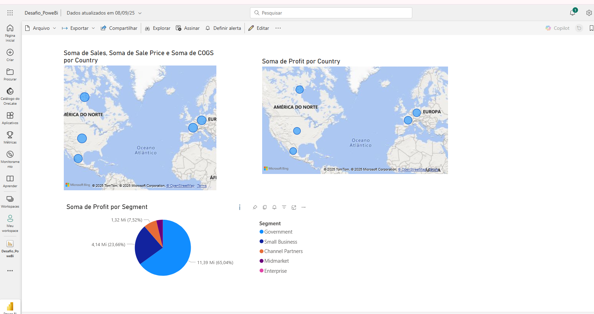

# Desafio Power BI - Relatório de Análise Financeira (DIO)

Este repositório documenta a conclusão do desafio de projeto do curso "Power BI Analyst" oferecido pela [Digital Innovation One (DIO)](https://www.dio.me/).

O objetivo foi aplicar conhecimentos práticos em Microsoft Power BI para construir um relatório interativo a partir de uma base de dados de exemplo (`Financial Sample.xlsx`), demonstrando habilidades na criação e formatação de visuais.

---

## 🛠️ Ferramentas Utilizadas
* **Microsoft Power BI Desktop:** Ferramenta principal para tratamento dos dados e criação do relatório.
* **Excel:** Utilizado como fonte de dados (Data Source).
* **Git & GitHub:** Para versionamento de código e hospedagem do projeto.

---

## 📊 Estrutura do Relatório

O relatório final é composto por 3 páginas, sendo as duas primeiras réplicas do conteúdo do curso e a terceira o foco principal do desafio:

* **Páginas 1 e 2:** Contêm as análises e visuais desenvolvidos durante as aulas do curso, servindo como base para o aprendizado.
* **Página 3 (Página do Desafio):** Uma página criada do zero, composta pelos seguintes visuais:
    1.  **Mapa de Vendas e Unidades Vendidas por País:** Uma visualização geográfica que utiliza o tamanho das bolhas para representar o volume de vendas (`Sales`) e exibe as unidades vendidas (`Units Sold`) como dica de ferramenta.
    2.  **Mapa de Lucro por País:** Semelhante ao anterior, mas focado no lucro (`Profit`) gerado em cada localidade, permitindo uma análise de rentabilidade geográfica.
    3.  **Gráfico de Pizza - Lucro por Segmento:** Um gráfico que divide o lucro total (`Profit`) entre os diferentes segmentos de mercado (`Segment`), como Governo, Pequenas Empresas, etc., facilitando a identificação dos segmentos mais lucrativos.

---

## 🖼️ Dashboard Final (Página 3)

*Observação: Verifique se o nome do arquivo de imagem está correto (se é .jpg, .png, etc.)*

---

## 🚀 Como Utilizar o Projeto

Para explorar o relatório de forma interativa:
1.  Faça o download do arquivo `.pbix` presente neste repositório.
2.  Abra o arquivo utilizando o Power BI Desktop.

---

## 🙏 Agradecimentos

* Agradecimentos à **[Juliana Zanelatto](https://github.com/julianazanelatto)** por fornecer o repositório base e os dados para o desafio.
* À **[Digital Innovation One (DIO)](https://www.dio.me/)** pela excelente oportunidade de aprendizado e desenvolvimento profissional.
